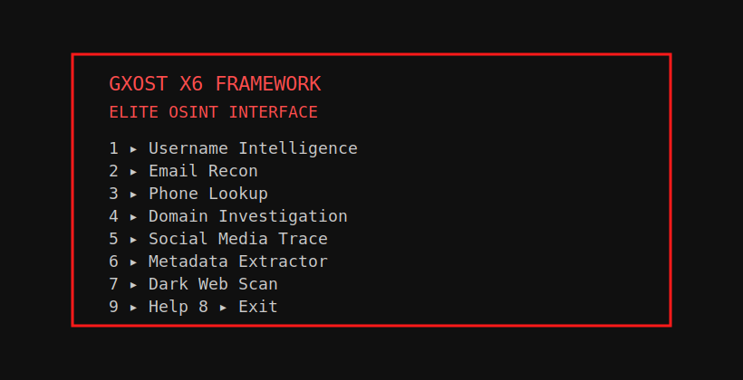

# GXOST X6

GXOST X6, kullanıcı adı, e‑posta, telefon, alan adı, metadata ve dark‑web araması için hafif, etkileşimli bir OSINT aracıdır. Python 3 ile yazılmıştır, renkli bir CLI arayüzü ve detaylı yardım menüsü sunar.



## Amaç
- OSINT süreçlerinde sık kullanılan adımları tek bir komut satırı aracıyla hızla uygulamak
- Etkileşimli menü ve doğrudan CLI komutlarıyla otomasyon ve kolay kullanım

## Özellikler
- Username Intelligence: popüler platformlarda kullanıcı adı izi ve özet
- Email Recon: format, domain, MX (DoH) ve Gravatar kontrolü
- Phone Lookup: E.164 normalizasyonu ve ülke kodu tahmini
- Domain Investigation: A/AAAA/MX/NS (Google DoH) ve çözümleme
- Social Media Trace: genişletilmiş platform listesi, özet ve detaylar
- Metadata Extractor: URL title/description; dosya boyutu/sha256/MIME tahmini
- Dark Web Scan: Ahmia indeksinden .onion link çıkarımı

## Gereksinimler
- Python 3.8+
- Windows PowerShell (Windows) veya Bash (Linux/macOS) için isteğe bağlı kurulum scriptleri

## Kurulum
### Klonla
```
git clone https://github.com/YOUR_USER/gxost.x6.git
cd gxost.x6
```

## Run
- Python:
```
python3 gxost.x6.py
# or
python gxost.x6.py
```

### Not
- Ek kurulum gerekmiyor. Klonladıktan sonra `python gxost.x6.py` ile çalıştırın.

## Yayın
- Standart Git komutlarıyla yayınlayın:
```
git init
git add -A
git commit -m "Initial commit"
git branch -M main
git remote add origin https://github.com/YOUR_USER/gxost.x6.git
git push -u origin main
```

## CLI Examples
```
python gxost.x6.py --help
python gxost.x6.py social octocat --json
python gxost.x6.py email test@example.com --json
python gxost.x6.py phone +905551234567 --json
python gxost.x6.py domain example.com --json
python gxost.x6.py meta https://example.com --json
python gxost.x6.py dark crash --json
```

## Klasör Yapısı
```
gxost.x6/
  docs/
    assets/
      menu.svg
  examples/
    usage.py
  tests/
    test_plan.md
  gxost.py
  gxost.x6.py
  LICENSE
  README.md
  .gitignore
```

## Versiyon
- v1.0.0

## Lisans
- MIT License (bkz. LICENSE)
